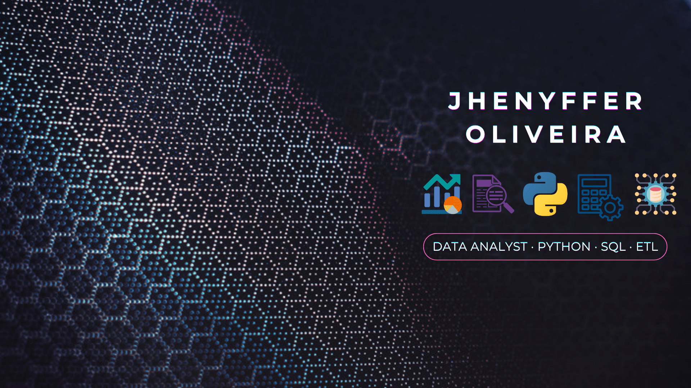
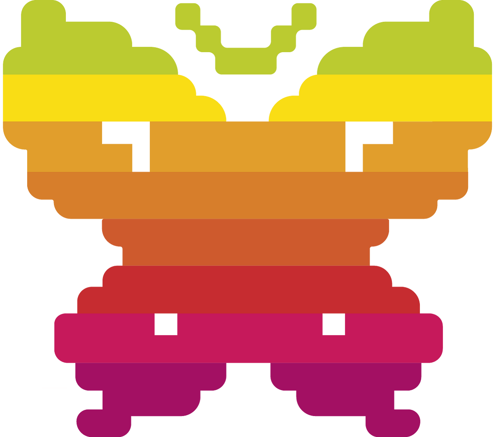

---

<h1 align="center">Hi 👋🏾 I'm Jhenyffer</h1>
<h3 align="center">A passionate junior data analyst from Brazil</h3>

 SQL - Python -  Statistics - Data Analysis - Data Visualization - 

---

<h1 align="left">👩🏾‍💻 About me</h1>

  

    I am a data analyst currently studying Data Science and Analytics, with an academic background in Linguistics and Literature. Proficient in English and Spanish, I am also learning French, allowing me to work with information in multiple languages. I combine my linguistic and analytical skills with my interest in data. I am results-oriented, creative, and resilient in the face of challenges and adversity.
  

  

  <h3>🤝🏾 Soft Skills</h3>
    Accommodating, communicative, organized, proactive, and committed.
  <h3>🗂️ Hard Skills</h3>
    Python (libraries and Django framework), SQL, data manipulation, data visualization, and statistics.
  

---

<h1 align="left">🎯 Meet Jhenyffer</h1>

-> 🌱 I'm currently working on improving my hard skills in SQL, Python, statistics, and data visualization (Power BI, Tableau, Looker Studio, Excel)

-> 📝 I share some of my experience about my career in articles on [medium](https://medium.com/@jhenyffer.tech)

-> 📫 You can reach me at **jhenyffer.tech@gmail.com**

-> 💬 You can also connect with me at [LinkedIn](https://linkedin.com/in/jhenyfferoliveira)

---

<h1 align="left">🚀 My Projects</h1>

I've had the opportunity to work on a variety of projects that showcase my learning and the skills I've acquired. These projects highlight my understanding and application of various concepts learned throughout my career transition. Below are some of my notable projects.

<h2> Personal Projects</h2>

As an autonomous student, I was responsible for the development of the following projects:

+ [Project 1](https://github.com/JhenyfferOliveira/etl-espaco-logos): This repository contains an Instagram data pipeline for an NGO, which collects social media metrics via the Meta API, stores raw data in Google Sheets, and powers dashboards in Looker using Python automation.

<h2>🏆 Hackaton</h2>

As a participant in hackathons events, I contributed to the development of the following projects:

+ [Competition 1 – Ada Hack](https://github.com/JhenyfferOliveira/Hackaton-ADAHACK): As a member of team DD-08, known as InclusiData Alchemy, I designed a diversity and inclusion solution based on data provided by Corp Solutions, a fictitious company for the competition. This project won **2nd place** in the data category, among nine teams.

 

<h2> Bootcamp by Ada Tech – Data Science</h2>

As a student, I was responsible for the development of the following projects:

+ [Project 6](https://github.com/JhenyfferOliveira/Projeto-PowerBI-Ada): This repository presents my final project for the Power BI course, demonstrating the complete process of managing, cleaning, processing, preparing, conducting statistical analysis, and visualizing data.

+ [Project 5](https://github.com/JhenyfferOliveira/Projeto-Estatistica-Ada): This repository hosts my final project, illustrating the process of managing, cleaning, processing, preparing, conducting statistical analysis, and visualizing data.

+ [Project 4](https://github.com/JhenyfferOliveira/Projeto-AnaliseDados-Ada): This repository showcases my final project for the Programming Techniques course, highlighting the integration of pandas and matplotlib, Python libraries, for data analysis, visualization and manipulation of dataframes.

+ [Project 3](https://github.com/JhenyfferOliveira/Projeto-BancodeDados-Ada): This repository displays my final project for the Database course, featuring SQL query commands and the integration of PostgreSQL with Python.

+ [Project 2](https://github.com/JhenyfferOliveira/Projeto-LPII-Ada): This repository covers my final project for the Programming Language II course, focusing on various intermediate concepts in Python.

+ [Project 1](https://github.com/JhenyfferOliveira/Projeto-LPI): This repository contains my final project for the Programming Language I course, highlighting several fundamental concepts in Python.

<h2> Bootcamp by WoMakersCode – Back-end Python and Django</h2>

As a student, I was responsible for the development of the following projects:

+ [Project 5](https://github.com/JhenyfferOliveira/BlogNoticias-Django-WoMakersCode): This project showcases my final project for the Django module in Python course, in which a news blog was created using Django tools to handle front-end, database, and back-end functionalities.

+ [Project 4](https://github.com/JhenyfferOliveira/ProjetoCurso-Django-WoMakersCode): This project involves an exercise in creating an application with Django and interacting with a database using the Python language. This challenge was completed individually.

+ [Project 3](https://github.com/JhenyfferOliveira/Flask-API-WoMakersCode): This repository displays my project for the API course, featuring a Flask-based API for data consumption.

+ [Project 2](https://github.com/JhenyfferOliveira/POO-BD-WoMakersCode): This repository covers my final project for the Object-Oriented Programming and Databases courses, where I practiced fundamental concepts in Python and SQL.

+ [Project 1](https://github.com/JhenyfferOliveira/HTML5-CSS3-WoMakersCode): This repository contains my final project for the HTML5 and CSS3 course, highlighting several fundamental concepts in HTML language.

---

<h1 align="left">🔎 What I believe</h1>

I have continuous learning as a focus in my career, always seeking updates and new skills. This is demonstrated by my commitment to constantly explore new techniques, tools, and approaches, culminating in a lifelong learning perspective. I believe that continuous learning is essential to keep up with the rapid changes in the field of data science and to deliver innovative and high-quality data analysis.

---

<h1 align="left">🤓 Languages and tools</h1>

